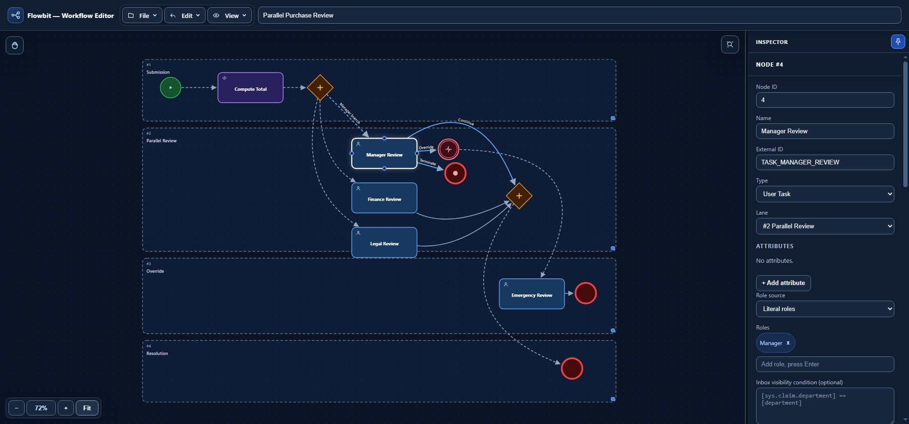
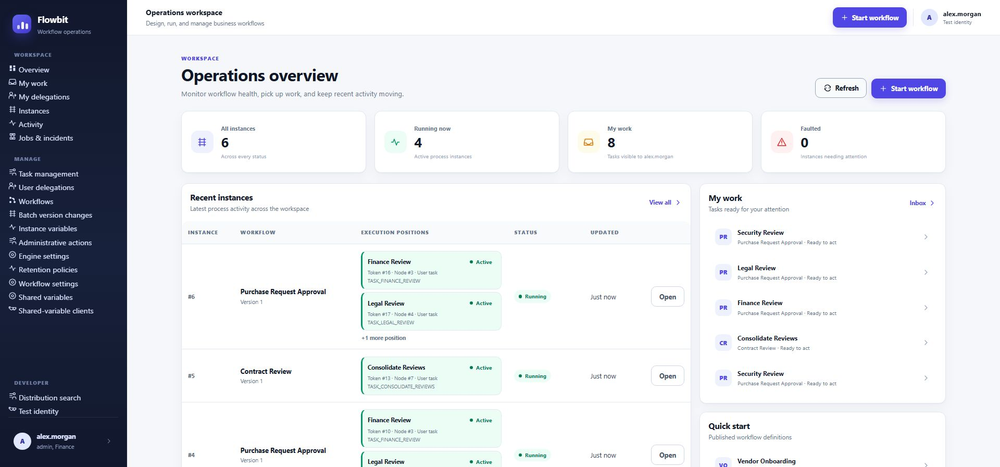
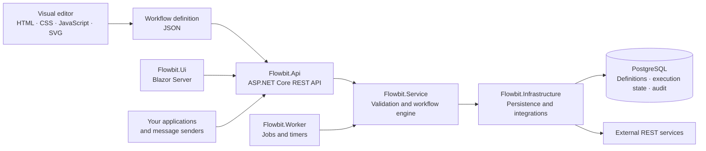

# Flowbit

**Turn business processes into visual, executable workflows.**

Flowbit brings human approvals, business rules, external systems, and long-running work into one workflow model. Design a process in the browser, save it as readable JSON, and execute it with a .NET 10 runtime backed by PostgreSQL.

From a two-step approval to parallel departmental reviews, quorum voting, webhook-driven intake, and deadline escalation, Flowbit makes the process visible and its execution traceable.

**Visual editor · .NET 10 · PostgreSQL · Blazor Server · REST API · BPMN-aligned**

[Developer documentation](docs/index.md) · [HTTP quickstart](docs/getting-started.md) · [Explore features](#what-you-can-build) · [Browse examples](examples/README.md) · [Architecture](#architecture) · [Runtime reference](Flowbit/README.md)



*The editor in dark mode displaying Parallel Purchase Review: script automation, concurrent human reviews, scope interruption, and task configuration in one view.*

## Why Flowbit

- **Make the process understandable.** Map responsibilities with lanes, connect tasks and decisions, and inspect the rules behind each step.
- **Give people the right work.** Role-aware inboxes, claims, assignments, delegation, and action permissions support real approval teams.
- **Connect the work to your systems.** Call REST APIs, receive messages, evaluate expressions, and run sandboxed JavaScript as part of the process.
- **Keep long-running work moving.** Persist waits, timers, asynchronous jobs, retries, and incidents in PostgreSQL.
- **Keep control as processes evolve.** Publish immutable workflow versions, inspect execution history, and preview compatibility before moving running instances to a newer definition.

## What you can build

| Business need | How Flowbit handles it | Try it |
| --- | --- | --- |
| Cross-department approvals | Run Finance, Legal, and Security reviews in parallel; continue when all branches finish. | [Parallel review](examples/gateways/02-parallel-fork-and-join.json) |
| Approval panels and voting | Create parallel or sequential review items, limit participation to one action per actor, and finish on a prioritized quorum. | [Early quorum](examples/multi-instance/04-early-quorum-and-priorities.json) |
| Controlled task ownership | Combine task and action roles with claiming, assignment, and explicit supervisor bypass. | [Roles and claims](examples/user-tasks/01-roles-claim-and-bypass.json) |
| Integration-driven processes | Build templated REST requests and map validated, typed response values back into the workflow. | [REST integration](examples/service-tasks/01-rest-templating-and-typed-output.json) |
| External order intake | Start from an authenticated message, map its payload, and apply business-key and transport-idempotency rules. | [Message start](examples/messages/01-message-start-typed-mapping.json) |
| Reminders and deadlines | Run recurring reminder branches while work stays open; interrupt and escalate when a deadline arrives. | [Reminder and escalation](examples/timers/05-user-task-reminder-and-deadline.json) |
| Risk-based escalation | Observe persisted business variables and interrupt an active review when its condition becomes true. | [Conditional boundary](examples/basics/08-interrupting-conditional-boundary.json) |
| Evidence-aware routing | Use recorded flow actions and traversals in NCalc, JavaScript, and gateway decisions. | [FlowInfo](examples/scripts/03-flowinfo-ncalc-and-javascript.json) |

The [example catalog](examples/README.md) includes start values, actor roles, expected outcomes, and runtime prerequisites. Integration examples need the documented credentials or a controlled mock service; timer and durable-job examples need the Worker. The reminder example records reminder activity; sending a notification requires an integration.

## Design visually

The [workflow editor](flowbit-editor.html) is a single HTML file built with vanilla JavaScript, CSS, and inline SVG. Open it in a modern browser: no installation, build step, or server is required for authoring.

- **Build the diagram:** drag nodes into lanes, resize containers, connect sequence flows, move multiple selections, snap to a grid, and undo or redo changes.
- **Navigate larger workflows:** search by name, ID, external ID, or node type; trace upstream, downstream, local, and connecting routes; use zoom and fit controls.
- **Configure the behavior:** edit roles, conditions, assignments, variables, integrations, timers, and multi-instance settings in a contextual inspector.
- **Work comfortably:** use light or dark themes, smart diagram labels, and a resizable, pinnable inspector.
- **Keep definitions portable:** validate before saving, export readable JSON, and load existing definitions for further editing.

The editor produces the same definition format the runtime consumes. Diagram layout and executable configuration travel together in one document.

## Execute with control



*Flowbit.Ui brings instance health, execution positions, personal work, and workflow starts into one operations workspace. Shown with sample approval, contract review, and onboarding data.*

Follow the [Flowbit.Ui guide](docs/ui-guide.md) to import and publish a definition, complete an approval in the browser, and use the management and operations screens.

### Human work and approval teams

User tasks support role-based access at both the task and action level, claim ownership, direct assignee expressions, required assignment, and claim or assignment inheritance. Runtime delegation lets authorized users act on another user's eligible work with audit attribution.

Task and action roles can come from declared `string[]` variables. Their effective permissions are captured when work is created; separately authorized managers can update the saved role policy of waiting work. An optional inbox visibility condition filters work against persisted variables and allowed actor context before database counting and paging.

Multi-instance tasks support collection-based assignees or expression-based cardinality, parallel or sequential execution, one-per-actor participation, early quorum or after-all evaluation, and parent-level interruption. Results retain the selected actions, submitted values, and actor evidence.

### Decisions, branches, and events

| Building block | Supported behavior |
| --- | --- |
| Tasks | Human tasks, automatic pass-through tasks, REST service tasks, and script tasks. |
| Exclusive gateways | Prioritized conditional routing with a default fallback; pass-through merges. |
| Parallel gateways | Fork concurrent execution tokens and join all static incoming branches. |
| Inclusive gateways | Select every matching branch and merge using graph reachability and active token positions. |
| Complex gateways | Evaluate activation conditions with incoming-count helpers and persisted start/reset cycles. |
| Starts and waits | Manual, message, and timer starts; intermediate message, timer, and conditional catches. |
| Boundary events | Error handling plus interrupting or non-interrupting timer and conditional paths. |
| Scope and completion | Scoped interrupts, cancelling joins, normal ends, terminate ends, and explicit error ends. |

Conditional events observe declared, persisted instance variables. They evaluate on entry and relevant variable-write batches, with either atomic continuation or a durable, latched wake processed by the Worker. Non-interrupting conditional boundaries can create new work on each false-to-true transition.

### Integrations and business data

- **REST service tasks:** template URLs, headers, and bodies; map typed outputs; validate responses; model failure handling with error boundaries.
- **Message endpoints:** start a workflow or resume a waiting instance with authenticated delivery, typed payload mapping, and optional duplicate-delivery protection.
- **Rules and scripts:** use NCalc for conditions and assignments, or sandboxed JavaScript through Jint for richer transformations.
- **Typed variables:** work with strings, numbers, booleans, dates, datetimes, arrays, and JSON, with defaults, required inputs, and validation rules.
- **Shared state and context:** bind declared aliases to a shared-variable catalog and read allowlisted actor context, deployment configuration, and workflow settings.
- **Separate identity contracts:** use business keys for domain ownership and independent idempotency keys for repeated start requests.

### Durable execution and operations

`asyncBefore` and `asyncAfter` introduce durable execution boundaries. The Worker leases persisted jobs from PostgreSQL, executes eligible work, and records attempts, retries, output conflicts, and incidents. Timers, subscriptions, and conditional wake fences survive process restarts.

Operators can inspect jobs and incidents, retry eligible failures, search instances and node executions, and review variable changes and flow evidence. Administrative tools support prepared batches for actions, variable updates, and workflow-version changes, with eligibility checks and per-item results. Eligible completed or cancelled instances can be previewed for controlled reactivation.

Health endpoints and Prometheus-format metrics expose worker readiness, queue activity, timing, retries, and incidents. Retention policies provide explicit control over historical data.

## Architecture



**Definitions are immutable JSONB snapshots. Execution state is relational.** PostgreSQL stores tokens, human work items, variables, gateway scopes, durable jobs, and audit records in the `flowbit` schema. A workflow instance can have multiple active execution tokens, while a multi-instance task owns its child work items under a parent execution.

Transitions use database transactions and instance-row locking. A consistent lock order and activation/lease fences coordinate concurrent API and Worker activity. Worker replicas acquire jobs with `FOR UPDATE SKIP LOCKED`; durable service jobs execute external calls between staging and finalization transactions.

Inbox and advanced search authorization, membership, counting, sorting, and paging remain database-authoritative. Latest variable projections support current-state queries, while history and node-execution records retain the audit trail.

| Project | Responsibility |
| --- | --- |
| [`flowbit-editor.html`](flowbit-editor.html) | Standalone visual authoring and JSON validation/export. |
| [`Flowbit.Api`](Flowbit/src/Flowbit.Api) | HTTP endpoints, JWT authentication, OpenAPI, and startup composition. |
| [`Flowbit.Service`](Flowbit/src/Flowbit.Service) | Workflow execution, definition validation, expression evaluation, and service contracts. |
| [`Flowbit.Infrastructure`](Flowbit/src/Flowbit.Infrastructure) | EF Core/Npgsql persistence, migrations, REST invocation, and Jint scripting. |
| [`Flowbit.Shared`](Flowbit/src/Flowbit.Shared) | Shared definition models and API DTOs. |
| [`Flowbit.Ui`](Flowbit/src/Flowbit.Ui) | Blazor interface for workflows, worklists, instances, and management. |
| [`Flowbit.Worker`](Flowbit/src/Flowbit.Worker) | Durable job dispatch, timers, recovery, health probes, and metrics. |

## Get started

For a complete HTTP integration walkthrough in **PowerShell or Bash**, start with the [developer documentation](docs/index.md). It covers setup, API contracts, BPMN support, and deployment. The steps below introduce the editor and operations UI.

### 1. Explore the editor

Clone the repository:

```bash
git clone https://github.com/sherif-hfm/Flowbit.git
cd Flowbit
```

Open `flowbit-editor.html` in your browser. Choose **File → Load JSON** and select [`examples/gateways/02-parallel-fork-and-join.json`](examples/gateways/02-parallel-fork-and-join.json) to explore a Finance, Legal, and Security review. Edit a node or connection, then choose **File → Save JSON** to validate and export the definition.

### 2. Start a local database

For the runtime, install the **.NET 10 SDK** and have **Docker** running. These PowerShell examples run from the cloned repository root and create a dedicated PostgreSQL 17 database for local evaluation.

```powershell
docker run --name flowbit-postgres --detach `
  --publish 127.0.0.1:55432:5432 `
  --env POSTGRES_DB=flowbit_demo `
  --env POSTGRES_USER=flowbit `
  --env POSTGRES_PASSWORD=flowbit-local-only `
  --volume flowbit-postgres-data:/var/lib/postgresql/data `
  postgres:17-alpine

docker exec flowbit-postgres pg_isready -U flowbit -d flowbit_demo
```

Wait for `pg_isready` to report that the database is accepting connections. On later runs, start the existing container with `docker start flowbit-postgres`. You can also use your own PostgreSQL instance and adjust the connection string below.

### 3. Run the API and UI

In an **API terminal**:

```powershell
$env:ConnectionStrings__Flowbit = 'Host=localhost;Port=55432;Database=flowbit_demo;Username=flowbit;Password=flowbit-local-only'
dotnet run --project ./Flowbit/src/Flowbit.Api/Flowbit.Api.csproj --launch-profile http
```

The `http` launch profile uses the Development environment, where the API applies database migrations automatically. Wait for startup to complete before starting the Worker or importing a workflow.

In a separate **UI terminal**, also at the repository root:

```powershell
dotnet run --project ./Flowbit/src/Flowbit.Ui/Flowbit.Ui.csproj --launch-profile http
```

Open the [Blazor UI](http://localhost:5152). The development API also exposes [Swagger](http://localhost:5017/swagger) and its [OpenAPI document](http://localhost:5017/openapi/v1.json).

### 4. Publish and run your first workflow

1. Open **Test identity** in the UI and generate an identity with the roles `admin, Finance, Legal, Security, Coordinator` so you can exercise every part of this demo.
2. Open **Workflows**, choose **Import editor JSON**, and select the parallel review example above.
3. Enable **Publish on import**, import the definition, and start its published version.
4. Open the inbox and complete the Finance, Legal, and Security tasks in any order.
5. Once the branches join, complete **Consolidate Reviews** with **Finish**.
6. Inspect the completed instance and its execution history.

For a more realistic team walkthrough, use separate identities for each review role. Other examples document the roles and input values they require. Workflow definitions are imported explicitly; API startup does not load a sample for you.

### 5. Enable timers and durable work

Run the Worker in a third terminal when using asynchronous activities, timers, durable conditional events, or background administrative batches:

```powershell
$env:ConnectionStrings__Flowbit = 'Host=localhost;Port=55432;Database=flowbit_demo;Username=flowbit;Password=flowbit-local-only'
dotnet run --project ./Flowbit/src/Flowbit.Worker/Flowbit.Worker.csproj
```

Confirm [Worker readiness](http://localhost:8081/health/ready), then try the [reminder and deadline example](examples/timers/05-user-task-reminder-and-deadline.json). [Liveness](http://localhost:8081/health/live) and [metrics](http://localhost:8081/metrics) are also available on the default Worker port.

The credentials above and the UI's test identity generator are for local development. Keep API/UI JWT settings aligned, supply deployment secrets through trusted configuration, and configure your deployment's authentication before exposing it. API and Worker processes must share the database and any workflow context configuration their definitions require. For existing databases and deployments, follow the migration and rollout notes in the [runtime reference](Flowbit/README.md).

## Integrate through the API

Use the REST API to embed workflow behavior in your own applications, with the Blazor UI available for human work and operations.

| Intent | Representative endpoint |
| --- | --- |
| Save and publish definitions | `POST /api/workflows` · `POST /api/workflows/{id}/publish` |
| Start an instance | `POST /api/instances` |
| Read the current actor's inbox | `GET /api/instances/inbox` |
| Claim work and take an action | `POST /api/user-tasks/{taskId}/claim` · `POST /api/user-tasks/{taskId}/flows/{flowId}` |
| Start from an external message | `POST /api/workflows/{workflowKey}/message-start` |
| Deliver a message to a waiting instance | `POST /api/instances/{id}/message` |
| Search current business state | `POST /api/instances/search` |
| Inspect activity across workflows | `GET /api/node-executions` |
| Investigate jobs and incidents | `GET /api/jobs` · `GET /api/incidents` |

User-facing endpoints use JWT authentication and the relevant authorization policy. Message delivery uses its configured client credentials and header contract. Consult the [API reference](Flowbit/README.md#main-api), development OpenAPI document, and [message guide](examples/messages/README.md) for request shapes and exact permissions.

## Model scope and execution guarantees

Flowbit implements a **BPMN-aligned subset** with familiar event, task, gateway, and lane shapes. Its native interchange format is JSON. Scoped interruption and cancelling joins are documented Flowbit extensions; BPMN XML import/export, pools and collaboration, compensation, event-based gateways, and DMN decision tables are outside the current model.

Durable state transitions are fenced and transactional. External REST effects have **at-least-once execution semantics**: retries can repeat a call, so downstream integrations should use a stable identifier such as `sys.jobId` for idempotency. The standalone editor needs no backend; executing workflows requires the API and PostgreSQL, with a Worker for durable work.

## Development and verification

The runtime solution is [`Flowbit/Flowbit.slnx`](Flowbit/Flowbit.slnx). Run the automated suite from the repository root:

```powershell
dotnet test ./Flowbit/tests/Flowbit.Tests/Flowbit.Tests.csproj
```

Docker is required for the isolated PostgreSQL integration tests. The suite covers engine behavior, persistence, authorization, API contracts, definition validation, selected editor helpers, and the example catalog. Browser layout and pointer interactions require real-browser verification in addition to automated tests.

See the [verification guide](Flowbit/README.md#verification) for the multi-instance verification tools, and [AGENTS.md](AGENTS.md) for architecture conventions and contribution checks.

## Explore further

- [Example catalog](examples/README.md): discover complete workflows and their expected behavior.
- [Human tasks](examples/user-tasks/README.md): roles, claims, and assignments; see the [catalog](examples/README.md#user-tasks) for waiting-task role management.
- [Multi-instance workflows](examples/multi-instance/README.md): reviewers, voting, aggregate outcomes, and interrupts.
- [Gateways](examples/gateways/README.md): splits, merges, activation conditions, and scope cancellation.
- [Scripts](examples/scripts/README.md): NCalc, JavaScript, variable access, and flow evidence.
- [REST integrations](examples/service-tasks/README.md) and [messages](examples/messages/README.md): request contracts, outputs, and failure paths.
- [Runtime reference](Flowbit/README.md): storage, operations, search, authentication, and deployment details.

**Start with a working example. Shape it around your process. Run it with Flowbit.**
