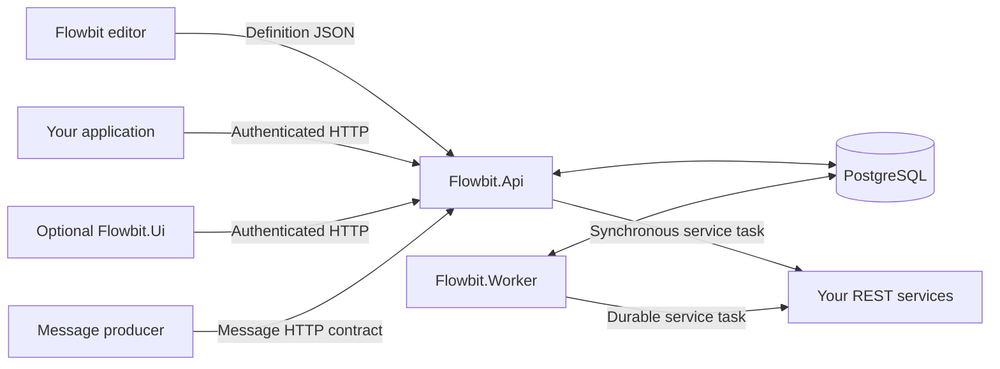

# Integrating Flowbit into your application

[Documentation home](index.md) · [First workflow](getting-started.md) · [API reference](api-guide.md)

Flowbit runs your business process as a durable, versioned workflow. Your application starts instances, presents the current actor's work, submits actions, and reads progress through HTTP. The engine owns routing, task authorization, persisted variables, timers, and execution history.

Start with the [runnable getting-started guide](getting-started.md). This guide explains the contracts to keep when replacing the sample UI with your own application. For every endpoint and response field, use the [API reference](api-guide.md).

## Contents

- [Choose the integration boundary](#choose-the-integration-boundary)
- [Authenticate the actual actor](#authenticate-the-actual-actor)
- [Understand a workflow definition](#understand-a-workflow-definition)
- [Keep identifiers distinct](#keep-identifiers-distinct)
- [Collect and validate variables](#collect-and-validate-variables)
- [Build an inbox and action form](#build-an-inbox-and-action-form)
- [Apply ownership and role policies](#apply-ownership-and-role-policies)
- [Handle parallel and multi-instance work](#handle-parallel-and-multi-instance-work)
- [Select and change workflow versions](#select-and-change-workflow-versions)
- [Integrate inbound messages](#integrate-inbound-messages)
- [Separate retries from business identity](#separate-retries-from-business-identity)
- [Integrate automatic work and durable jobs](#integrate-automatic-work-and-durable-jobs)
- [Read progress, search, and audit](#read-progress-search-and-audit)
- [Handle errors and concurrent changes](#handle-errors-and-concurrent-changes)

## Choose the integration boundary



| Component | Responsibility in an integration |
| --- | --- |
| Editor | Author and export JSON. The single HTML file can run independently of the engine. |
| API | Validate/version/publish definitions; start, inspect, and advance runtime work over HTTP. |
| PostgreSQL | Store immutable definition snapshots and transactional runtime state in the `flowbit` schema. |
| Worker | Execute durable jobs, timer events, and durable conditional wakes. It shares the API's database and required workflow context configuration. |
| Flowbit.Ui | Optional Blazor client for exploration, task handling, and operations. Your own application can use the API without running it. |

Keep application business records in your application's store and retain the returned Flowbit instance ID as the link. Use a configured business key when the engine must also enforce domain uniqueness. Update engine state through its APIs and authored activities; direct writes to runtime tables bypass transactions, authorization, subscriptions, and audit.

No BPMN XML import/export or embedded BPMN SDK is implied by this integration. Flowbit consumes its own BPMN-aligned JSON model; consult the [supported elements and extensions](bpmn-support.md) before translating another engine's process.

## Authenticate the actual actor

User-facing API operations use bearer JWTs. The current API validates issuer, audience, lifetime, and a shared symmetric signing key through `Jwt:Issuer`, `Jwt:Audience`, and `Jwt:Key`. There is no built-in token-issuance HTTP endpoint or production OIDC configuration path. Integrating an OIDC authority requires an authentication implementation change.

For local development, obtain a token from Flowbit.Ui's `/token` page as shown in [getting started](getting-started.md). The UI keeps its token in a **process-wide singleton**: changing the test identity affects the identity used by that UI process. Per-user production UI authentication requires implementation; it is not enabled by entering a different JWT setting.

Check the API's resolved identity instead of assuming a claim in an unvalidated token is the actor:

```http
GET /api/auth/context HTTP/1.1
Authorization: Bearer <token>
Accept: application/json
```

Example response for an identity created with these roles:

```json
{
  "user": "alice",
  "roles": ["Requester", "Reviewer"]
}
```

`Authentication.UserIdentityClaim` is an engine setting read once at API startup. When present, it selects the canonical actor claim; a missing, blank, or ambiguous value in the token fails authentication. Without that setting, the API uses `Identity.Name`, then `NameIdentifier`. Plan identity changes across all API replicas and existing task ownership; changing this setting requires restart. `WorkflowContext.AllowedClaims` separately controls expression access to claims and does not choose the actor.

Workflow-definition endpoints have an additional role gate: `Workflow.RequiredRole`, defaulting to `admin`. This role does not automatically satisfy authored `Requester`, `Reviewer`, or other task roles. Administrative and operational endpoint families have their own policies, documented in the API reference.

Access scopes differ by resource. The inbox and personal task routes enforce task visibility, ownership, and actor roles. **The current `GET /api/instances/{id}` endpoint requires authentication but does not apply those personal task-visibility checks.** Do not expose it as a per-tenant or per-owner data boundary without implementing that boundary in your integration. Instance lists, activity searches, management routes, and message routes each have their own authorization contract.

## Understand a workflow definition

For a complete catalog of task, event, and gateway properties, including defaults, validation rules, and nested configuration, see the [node and property reference](node-reference.md).

The [Roles, Claim, and Bypass example](../examples/user-tasks/01-roles-claim-and-bypass.json) is the canonical first integration. Its root structure has these responsibilities:

| JSON field | Meaning |
| --- | --- |
| `id` | Stable workflow key shared by all versions in a workflow family. |
| `name` | Display name. |
| `initialEventId` | Default user-startable `startEvent` node ID. Pass `startEventId` explicitly to select another plain start. Message and timer starts use their own entry mechanisms. |
| `flowNodes` | Events, tasks, and gateways with authored integer IDs and type-specific configuration. |
| `sequenceFlows` | Directed connections with integer IDs, `sourceRef`, and `targetRef`; user-task outgoing flows also describe actions and their input contracts. |
| `variables` | Top-level process-variable declarations, initialized or bound by the engine. |
| `lanes` | Editor layout containers. Placing a node in a lane does not grant a runtime role. |
| `cancelRoles`, `unclaimRoles` | Separate workflow permissions for cancellation and recovery unclaim. |
| `taskAssignmentRoles`, `taskRoleManagementRoles` | Separate permissions for ownership management and editing waiting work's captured roles. Empty lists disable those management capabilities. |

Nodes and flows may carry ordered `attributes` string key/value pairs for application metadata, such as a form identifier. They do not execute code, create permissions, or change routing. The engine returns them on relevant task/flow contracts. Keep credentials in server-side configuration, not attributes or definition JSON.

A minimal approval definition is structurally shaped like this:

```json
{
  "id": "minimal-approval",
  "name": "Minimal Approval",
  "initialEventId": 1,
  "variables": [],
  "lanes": [],
  "flowNodes": [
    { "id": 1, "name": "Start", "type": "startEvent", "roles": ["Requester"] },
    { "id": 2, "name": "Review", "type": "userTask", "roles": ["Reviewer"], "requiresClaim": true },
    { "id": 3, "name": "Approved", "type": "endEvent" }
  ],
  "sequenceFlows": [
    { "id": 101, "name": "Open review", "sourceRef": 1, "targetRef": 2 },
    { "id": 201, "name": "Approve", "sourceRef": 2, "targetRef": 3 }
  ]
}
```

This illustrates the execution structure; use the curated sample for a laid-out diagram and validated input fields. Submit a definition inside the API request envelope, `{"definition": <workflow object>, "publish": false}`. Saving performs server-side validation and creates a versioned snapshot. An editor export by itself does not publish a runnable definition.

Node IDs must be unique within the node collection; flow IDs must be unique within the flow collection, and references must resolve. Variable names are compared case-insensitively and duplicates within a declaration collection are rejected. Model configuration is validated against each node's topology and supported feature set. A normal user task cannot have a default flow; a multi-instance user task must have its engine-only default fallback.

## Keep identifiers distinct

| Identifier | Example | Use |
| --- | --- | --- |
| Workflow key / definition JSON `id` | `example-user-task-roles-claim-bypass` | Stable family key for starting the published default and searching across versions. |
| Workflow definition database `id` / request `workflowId` | A returned integer | One immutable version; use for publication, exact-version starts, or version-change targets. |
| `version` | `1` | Human-facing version number within a family; it is not the database ID. |
| Instance `id` | A returned integer | One process run; use in `/api/instances/{id}` and persist in your business record. |
| Authored node `id` | `2` in the tutorial | A node in the definition, reused across visits and instances. |
| Authored flow `id` | `201` in the tutorial | An edge/action in the definition; returned by action discovery. |
| `externalId` | `FLOW_APPROVE_AFTER_CLAIM` | Optional authored integration label; useful for mapping a discovered action to an application command. It is not the runtime task ID. |
| `userTaskId` / task `id` | A returned integer | Exact work item to claim or complete, including one multi-instance child. |
| `tokenId` | A returned integer | One persisted execution position; an instance may own several. |
| `multiInstanceExecutionId` | A returned integer | One repeated-task execution and its aggregate state; used for parent interrupts and role management. |
| Node-execution `id` | A returned integer | One committed node visit or multi-instance child lifecycle in the activity ledger. |
| `rolePolicyId` | A returned integer | Immutable role snapshot used as the concurrency token for role edits. |
| Job ID / activation ID | Returned integer / UUID | Durable work and the activation it belongs to; used for operations and stale-result fencing. |

Capture IDs from responses. Do not assume the first imported workflow, started instance, or created task has database ID `1`. In HTTP examples below, `{instanceId}`, `{taskId}`, and similar placeholders mean previously returned IDs.

## Collect and validate variables

Declarations describe input and storage contracts; submitted values are a JSON object keyed by variable name:

```json
{
  "variables": {
    "reviewNote": "Approved after budget review."
  }
}
```

| Declaration location | How values enter the engine |
| --- | --- |
| Plain start-event `variables` | Collected in `POST /api/instances`. Only this selected start's inputs are collected. |
| User-task sequence-flow `variables` | Collected when that specific action is taken. A user task itself is not a generic process-variable update form. |
| Top-level `variables` | Instance values initialize from defaults, or nullable null, and can be written by supported producers such as scripts and mappings. Shared declarations bind to the shared catalog. |
| Message-start `message.outputMappings` | Both typed declarations and extraction rules for the message payload. |
| Service/message-catch `outputMappings` | Typed operation-specific writes to process-variable targets. |

Use actual JSON types on HTTP requests:

| `dataType` | Example JSON value | Contract |
| --- | --- | --- |
| `string` | `"REQ-DEMO-001"` | A JSON string. |
| `number` | `149.95` | A JSON number; `"149.95"` is a string and fails external input typing. |
| `boolean` | `true` | A JSON boolean; `"true"` is not equivalent. |
| `date` | `"2026-09-09"` | A valid `yyyy-MM-dd` string. |
| `datetime` | `"2026-09-09T12:00:00Z"` | A parseable ISO datetime string containing `T`; use an explicit UTC offset for interoperable clients. |
| `json` | `{"source":"portal","priority":2}` | A JSON value; objects and nested values are preserved. It does not imply JSON Schema validation. |

`isArray: true` requires a JSON array whose elements match the declared type. `string` plus `isArray: true` means `string[]`, not a comma-separated string.

Input `required: true` requires an explicitly supplied, non-null value; whitespace-only strings count as missing. Required start/flow inputs cannot also define a default. Optional inputs may use a typed `defaultValue` when omitted. Missing optional values without defaults are not a request to clear existing state. Supply only declared fields: the action endpoint is not a general variable-patch endpoint, and extra properties are not a supported write mechanism.

Top-level instance variables require a default unless `nullable: true`. This nullability flag belongs to top-level declarations, not start/action inputs, and it is independent of whether an input is required. Omitted nullable defaults initialize to null. The `json` type accepts JSON values, including null where the surrounding contract allows it; required-input checks still reject null.

Defaults may contain `${variableName}` and allowed context placeholders. Declaration order matters when one default references another: later defaults can use earlier resolved values. NCalc `validation` rules run against the final collected values plus stored/context values, so cross-field validation is possible. Failed rules reject the transition. A client may validate early for usability, but the server remains authoritative.

For the tutorial, the start requires `requestReference` with `Len(Trim(requestReference)) >= 3`. The approval action requires `reviewNote` with the same minimum length. The supervisor escalation action instead requires `escalationNote` with a minimum trimmed length of five. Send the selected action's own fields.

### Output mappings and expression context

Service and message output mappings define `variable`, `path`, `dataType`, `isArray`, `required`, optional `defaultValue`, and optional `validation`. Paths select values from the JSON payload. Defaults apply to missing paths, not to present values of the wrong type. Outputs are validated as a batch before persistence, including checks against target variable contracts; a rejected message mapping does not partially write values.

String templates use `${sys.user}` or `${config.apiToken}`. NCalc expressions use bracketed dotted names, such as `[sys.user] == requester`. Available context includes system time/identity and instance/node information (`sys.*`), allowlisted token claims (`sys.claim.*`), server configuration (`config.*`), and database workflow settings (`setting.*`). This context is read-only and is not automatically persisted as instance variables. Context availability depends on the evaluator: conditional event predicates, for example, allow persisted instance-variable dependencies and reject these external context sources.

Shared aliases are declared only at the process level with `scope: "shared"`, `sharedKey`, and `access: "read"` or `"readWrite"`. They must match an existing catalog entry's canonical key and type/array/nullability/validation contract. They are not per-instance copies, do not appear as ordinary instance variable values, and cannot be used in conditional event predicates. A REST task accessing shared bindings requires `asyncBefore: true`. Use the [shared-variable runtime reference](../Flowbit/README.md#shared-variables) for authorization, revision checks, and transaction restrictions.

## Build an inbox and action form

Use the actor's inbox as your worklist, rather than deriving work from an instance's representative current node:

```http
GET /api/instances/inbox?workflowKey=example-user-task-roles-claim-bypass&page=1&pageSize=50&includeVariables=true HTTP/1.1
Authorization: Bearer <token>
```

Read `items`, `page`, `pageSize`, and `totalCount`. Each row includes its exact `userTaskId`, ownership, role information, and `canClaim`/`canAct` flags. `includeVariables` defaults to false; enabling it returns a latest-value object, not variable audit history.

1. Open the selected `GET /api/user-tasks/{taskId}`. Render ownership and `capabilities`, including `canUnclaim`.
2. If permitted and needed, `POST /api/user-tasks/{taskId}/claim` with no body. Use the returned task state.
3. Call `GET /api/user-tasks/{taskId}/flows` after claiming to discover the actor's currently executable actions. Build each action's form from its `variables` and application metadata.
4. Submit the selected returned flow ID and its input values. Refresh task/inbox/instance state after success or conflict.

```http
POST /api/user-tasks/{taskId}/flows/{flowId} HTTP/1.1
Authorization: Bearer <token>
Content-Type: application/json

{
  "variables": {
    "reviewNote": "Approved after budget review."
  }
}
```

In the curated tutorial, discover `FLOW_APPROVE_AFTER_CLAIM` and use its returned `id` for `{flowId}`. The response is a `UserTaskActionAckDto`, including `userTaskId`, `instanceId`, `taskStatus`, `instanceStatus`, `selectedFlowId`, `executionPositions`, and optional progress/completion/fault information. A successful action does not necessarily complete the whole instance.

Treat capability flags and discovered actions as a snapshot. Another actor, timer, message, variable update, or manager may change eligibility between rendering and submission. The server rechecks authorization and state under its transaction locks.

A user-task outgoing `condition` uses **already persisted state**, before submitted action variables are applied. Posting a new value cannot make a previously hidden action executable in that same request. If your business process requires a decision based on newly entered values, submit them through an available action, then route through an appropriate gateway.

`inboxVisibilityCondition` is different: its bounded expression runs in PostgreSQL before membership, count, ordering, and paging. Only true includes a task; missing, null, invalidly typed, or failed arithmetic operands do not make it visible. Personal detail and mutations recheck the predicate and can return `404`. Management, distribution, and administrative operations retain their separate privileged scope.

An inbox item can remain in its database page with `canAct=false` and `canClaim=false` when none of its actions are eligible. Preserve the server's count and order; do not treat this as a broken task or silently remove it while displaying the original total.

## Apply ownership and role policies

Task eligibility combines several independent rules:

| Rule | Effect |
| --- | --- |
| Task `roles` | The actor must match at least one role when the list is non-empty. Role comparisons are case-insensitive. |
| Action `roles` | Adds another role check to the task's check; passing one does not bypass the other. |
| `requiresClaim` | Requires claim ownership for ordinary actions on shared-pool work. |
| `canActWithoutClaim` | Allows an otherwise-authorized actor to bypass a claim for this flow. A non-empty `canActWithoutClaimRoles` adds a bypass-specific role requirement. |
| `assignee` / `requiresAssignment` | Direct ownership and assignment gating. A claim bypass never overrides direct assignment. |
| `inboxVisibilityCondition` and flow `condition` | Membership and action guards, respectively. |

Empty literal task/action role lists mean unrestricted **within the endpoint's authenticated scope**. This is different from empty management-role lists, which disable that management permission. Claim inheritance and assignment inheritance can carry prior ownership into later work; inspect the created task rather than assuming every visit begins unowned.

In the tutorial, `Requester` starts; `Reviewer` or `Supervisor` can perform the review. `Supervisor` alone can select the escalation flow without acquiring the claim, including when another actor holds it. The flow still requires the supervisor role and its own input contract. `WorkflowAdministrator` permits cancellation for this example; it is not an automatic action override.

### Dynamic roles and management

`rolesVariable` on a user task or selectable non-default action references a declared process `string[]` variable. Task and action roles are captured together when work is created. Later variable changes, pending-item activation, or reassignment do not re-evaluate that captured policy. Invalid dynamic values fail closed.

An authorized `taskRoleManagementRoles` actor can inspect and replace the waiting role policy with `GET`/`POST /api/user-tasks/{taskId}/roles` for a normal task, or `/api/multi-instance-executions/{executionId}/roles` for a repeated task. Use the returned `rolePolicyId` as the request's `expectedRolePolicyId`, and submit the complete task/action role lists and an optional reason. An identical stale retry is unchanged success; a different stale edit is `409`. A multi-instance edit updates all unfinished children atomically and preserves completed history and ownership.

Ownership management uses `/assign` and `/unassign`, authorized independently through `taskAssignmentRoles`, with the task's returned `updatedAt` supplied as `expectedUpdatedAt`. Machine task distribution has its own configured workflow-family client credentials. Neither assignment management nor role management automatically grants normal action authority.

### Delegated work

Standing delegation is runtime policy, outside the workflow definition JSON. Its APIs create, accept/reject, and revoke time-bounded grants under the configured workflow delegation policy. Eligible delegated tasks appear through the existing inbox and task APIs with `delegatedAccess` identifying the grant and represented owner. The delegate signs in as themselves, still needs the applicable roles, and never obtains the owner's JWT or impersonates their role set. Completion audit preserves the actual actor and the represented owner. Use the server's capabilities and grant metadata instead of changing `claimedBy` in your client.

## Handle parallel and multi-instance work

An instance can own multiple active execution tokens. `currentNodeId`, `currentNodeName`, and `currentNodeExternalId` are representative display fields. Use `executionPositions` for concurrent positions and the inbox/task endpoints for actionable work. Do not assume one instance means one task, one claimant, or one waiting message.

Parallel/inclusive/complex gateways create and synchronize token work according to their topology. A normal end completes its branch; the instance remains running while other work is active. Terminate ends, error ends, scoped interrupts, and cancelling joins can cancel siblings. Refresh affected work after any transition instead of predicting sibling state entirely in the client.

A multi-instance user task owns one parent execution with many child work items. `collection` mode snapshots a `string[]` of directly assigned usernames; `cardinality` mode evaluates the item count and uses role/claim rules. Work can be parallel or sequential. Always submit a child action to its `userTaskId`.

For `onePerActor: true` cardinality work, the inbox offers one representative item per actor and an actor can complete at most one child in that execution. Two actors can initially see the same representative. If another actor wins the race, handle `409` and refresh to discover the next eligible item.

Aggregate completion conditions may run after each item (`afterEach`, the default) or after all items (`afterAll`). A winning outcome cancels unfinished work and advances the parent once. Engine-only flows (`isSelectable: false`) participate in aggregate routing but are never user actions; every multi-instance task requires one pure engine-only default fallback. The results record child votes separately from the final aggregate traversal.

Parent-level interrupt actions have their own discovery and execution routes:

```http
GET /api/multi-instance-executions/{executionId}/flows HTTP/1.1
Authorization: Bearer <token>
```

An authorized parent interrupt requires task and flow roles, but not an active assigned child or a claim. It can finish the parent and cancel unfinished children immediately, including under `afterAll`. Use its returned instance state to refresh the worklist. See the [multi-instance examples](../examples/multi-instance/README.md) for complete configurations.

The legacy instance-addressed claim/unclaim/flow routes return `409` when more than one active task makes the target ambiguous. Build new clients on task-addressed routes.

## Select and change workflow versions

Create/import a definition, publish its returned database ID, and explicitly select the desired published default when starting by key. `PUT /api/workflows/{id}` creates a new immutable version; it does not rewrite running instances' definitions. A start must supply exactly one selector: an exact published `workflowId`, or a `workflowKey` that resolves to its published default. Supplying both or neither returns `400`. An unpublished definition cannot start a new instance.

Keep authored IDs and integration labels stable when behavior is meant to remain compatible. Changing a workflow's default affects future starts; existing instances retain their version unless an authorized version-change operation succeeds.

For active instance migration, call `POST /api/instances/{instanceId}/version-change/preview` with `targetWorkflowId`. Inspect `compatible`, `blockers`, and `warnings`; then submit the change with the preview's `expectedSourceWorkflowId`, `expectedUpdatedAt`, and a reason. The server revalidates in the mutation transaction. Do not copy a preview's concurrency values between instances or retry a stale change unchanged without rereading state.

Compatibility includes persisted variables, open task/action and role contracts, gateway/branch state, message/timer/conditional waits, and durable work. A same-family target is not sufficient by itself. Use the batch preview/execute APIs for managed migrations of many instances; see the API reference for their lifecycle. Database-schema upgrades and instance-definition version changes are separate operations.

## Integrate inbound messages

There are two message entry points:

| Endpoint | Selection and authentication |
| --- | --- |
| `POST /api/workflows/{workflowKey}/message-start` | Starts the published default's message start. Use the `startEvent` external-ID selector when needed to choose between message starts. |
| `POST /api/instances/{instanceId}/message` | Delivers to a waiting message catch in an existing instance. Use `catchEvent` with the exact authored external ID when multiple waits are ambiguous. |

These routes opt out of bearer authentication and authenticate the node's configured `X-Client-Id` and `X-Client-Secret`, plus its required custom-header contract. “Anonymous” in OpenAPI means no user bearer requirement, not unauthenticated delivery. Use the documented [message examples](../examples/messages/README.md) for payloads and server-side credential configuration.

For the curated catch example, once the instance reaches its message wait:

```http
POST /api/instances/{instanceId}/message HTTP/1.1
Content-Type: application/json
X-Client-Id: example-message-client
X-Client-Secret: <configured server-side secret>
X-Purchase-Order: PO-1001
X-Flowbit-Delivery-Key: provider-receipt-0001

{
  "receipt": {
    "accepted": true,
    "code": "RCPT-1001",
    "amount": 149.95,
    "receivedAt": "2026-09-09T12:00:00Z",
    "warnings": [],
    "provider": "example-provider"
  }
}
```

The payload is raw business JSON, not a `variables` envelope. Typed output mappings select its values. Non-empty message bodies require a JSON media type and must fit `WorkflowMessageDelivery.MaxPayloadBytes`. Acknowledgments contain runtime IDs/position/status and optional completion/fault data, rather than exposing the instance's full definition and history to the machine caller.

Message correlation is instance-scoped; it is not a cross-instance BPMN message bus. Store the returned instance ID for later deliveries, and model timer boundaries if a message wait needs a timeout route.

## Separate retries from business identity

| Contract | Configuration | Lifetime and behavior |
| --- | --- | --- |
| Start transport idempotency | Entry-node `idempotency` with `headerName` and an implicit variable name | Claims one request key across the workflow family permanently after commit. A duplicate returns `409`, not a replayed success response. |
| Business identity | Entry-node `businessKey` with a required string `variable` and `uniqueness: "active"` or `"all"` | Prevents duplicate domain cases for the family while active, or permanently. A new transport request can still conflict with an existing business case. |
| Catch delivery idempotency | `message.deliveryIdempotency` and optional `deliveryIdempotencyHeaderName` | Reserves a successfully committed delivery key for that instance; duplicates are `409`. It is independent of message correlation. |

Keys are trimmed, bounded to 300 Unicode characters, and case-sensitive. A start's transport header defaults to `Idempotency-Key` and also accepts the documented `X-Idempotency-Key` alias for that standard name; conflicting values are rejected. The header-derived start variable must not also be submitted in the body. Sending an arbitrary idempotency header to an unconfigured operation does not make that operation idempotent.

For a concrete keyed start, import and publish the [business-key example](../examples/start-events/README.md), choose its default, and use a token with `ActiveCaseStarter`:

```http
POST /api/instances HTTP/1.1
Authorization: Bearer <token>
Content-Type: application/json
Idempotency-Key: request-20260909-001

{
    "workflowKey": "example-start-business-key-scopes-idempotency",
  "startEventId": 1,
  "variables": {
    "caseId": "ACTIVE-REQ-DEMO-001",
    "caseSummary": "Purchase approval from the customer portal"
  }
}
```

Persist the transport key before the initial request and reuse that exact key after an uncertain network outcome. A committed transport duplicate returns:

```json
{ "code": "idempotency_conflict", "instanceId": 123 }
```

Here `123` is an illustrative existing ID, not an ID to copy. The `Location` response header points to the existing instance. A normal-start business-key conflict instead uses `code`, `error`, and `existingInstanceId`; message-start conflicts use `code` and `instanceId`. A catch conflict adds `sourceNodeId` and uses `idempotency_conflict` or `message_wait_conflict`. Handle each contract explicitly and reconcile the existing instance under the appropriate authorization.

The `active` business key becomes reusable after completion, fault, or cancellation, while the original transport key remains reserved. `all` remains reserved through those terminal states. Enabling business keys for a workflow family also constrains starts of older unkeyed versions; do not use an older version ID to bypass the family policy.

## Integrate automatic work and durable jobs

Without an asynchronous boundary, automatic tasks, scripts, REST services, and gateways run as part of the initiating engine transition until the instance reaches a wait or end. A slow synchronous service call can therefore extend the initiating API request. A modeled error boundary can route a service/script failure into business handling; an unhandled failure may reject the transition.

`asyncBefore` and `asyncAfter` create durable transaction boundaries on supported task types. Timer events and `conditional.deliveryMode: "durableAsync"` also need Worker processing. Configure the Worker and publication gate as described in [deployment](deployment.md); publishing a durable definition is not proof that a worker is processing it.

Durable external work is **at least once**. The worker stages work, invokes the external operation outside the long-running database transaction, and validates its lease/activation and output versions when finalizing. If a worker fails after a remote system commits but before Flowbit records success, the same work may be attempted again. The remote API must deduplicate effects.

For an asynchronous REST task, a service-header configuration can send the stable job ID to a downstream endpoint that supports idempotency:

```json
{
  "name": "Idempotency-Key",
  "value": "${sys.jobId}"
}
```

This is an authored `service.headers` entry, not an API response. `sys.jobId` remains stable across retries of that job; `sys.jobAttempt` identifies the attempt. Namespace the key in the downstream system if several Flowbit deployments share that endpoint. A later new activity/job is a separate operation. Flowbit's transaction locks cannot make a remote HTTP effect exactly once or physically cancel an already-running remote call.

Durable job policies control retry schedules and error-boundary precedence. Exhausted or conflicting work can open an incident for an authorized operator to inspect and retry. Do not resubmit the original user action to recover a job: the user action may already be committed. Read the instance's execution positions/job summary and use operational APIs instead.

Atomic conditional catches evaluate within the variable writer's transaction. Durable conditional catches latch a true result and queue a wake that remains valid even if a later write makes the condition false. Conditional boundaries may also create sibling work or interrupt a host. Account for those transitions when your application updates variables administratively or submits outputs.

## Read progress, search, and audit

Use the resource that matches the question:

| Question | Read model |
| --- | --- |
| What can this actor do now? | Actor inbox, task detail, and task flow discovery. |
| Where is this process currently waiting? | Instance `executionPositions`, grouped `userTasks`, multi-instance and gateway progress, job summaries. |
| Which cases currently match business data? | Instance list/search, with workflow key, business key, node selectors, and latest-variable predicates. |
| What happened on a specific node visit? | `/api/node-executions` and its detail endpoint; visit status, timestamps, reasons, and attributed variable changes. |
| What values and transitions were recorded for an instance? | Instance detail `variables`/`history` and task history; these are audit collections, not one flat current-value object. |

List enrichment with `includeVariables=true` returns latest values. Repeated `var=name:value` filters use exact, case-insensitive comparisons of latest scalar values; arrays and objects do not match that shorthand. For typed/nested comparisons and Boolean composition use the structured `variableFilter` on the search APIs. Counting, authorization, sorting, and paging remain database-authoritative.

Instance lists use opaque cursors: follow `nextCursor` after the first page and keep the sort contract consistent. The inbox uses ordinary page/page-size selection. Do not assume every endpoint exposing `PagedResult` has the same paging mode; job, incident, attempt, and activity contracts are documented separately in the API reference.

Node-execution searches apply their own read policy. Latest-variable filters on these searches refer to the owning instance's current values, not values captured at visit time. The node ledger records committed visits from its deployment cutover onward; older completed visits are not reconstructed from transition history. Retention may remove older audit records and is relevant if your application needs historical evidence or later reactivation.

### Flow evidence in authored logic

`FlowInfo(flowId, 'path')` makes instance-lifetime action/traversal summaries available to supported workflow expressions. An explicit human selection is an action; movement of an execution token is a traversal. A multi-instance child vote is action-only, while its aggregate outcome is traversal-only. Counts and last-evidence snapshots let a downstream decision inspect who selected a route, including captured roles and values.

This is an authored expression facility, not a general HTTP query endpoint. It is supported in non-default Exclusive, Inclusive, and Complex outgoing conditions, multi-instance completion conditions, and script tasks; it is rejected in Complex activation conditions, action visibility, assignee/cardinality, and variable/output/header validation. `CountFlow`/`PercentFlow` remain local to the current multi-instance execution. No pre-deployment evidence is invented. See the [flow-evidence runtime reference](../Flowbit/README.md#instance-wide-flow-evidence-flowinfo) for paths, shapes, and persistence behavior.

## Handle errors and concurrent changes

Inspect HTTP status **and** the response contract. A successful transport response can still describe a committed business fault through `status`/`instanceStatus` and `fault`; it is not a guarantee that the process reached its happy-path end.

| Result | Client behavior |
| --- | --- |
| `400` | Show the validation/domain error and correct the request or workflow state. Some authored role mismatches also use this status. Do not classify every `400` as malformed JSON. |
| `401` | Obtain valid credentials or correct the configured actor claim. A message client must correct its message credentials, not acquire a user JWT. |
| `403` | The authenticated caller lacks the endpoint's required authority. Repeating the same request will not add it. |
| `404` | The resource is absent or unavailable in this caller's personal scope. Refresh the worklist; do not infer that hidden work has been deleted. |
| `409` | Reconcile stale ownership, activation, role policy, version preview, or a duplicate key. Refresh authoritative state before deciding whether another request is appropriate. |
| `413` / `415` | Reduce the payload or use the endpoint's required media type. |
| Connection loss / timeout / server failure | Treat a mutation's commit outcome as uncertain. Read state; use only the operation's documented deduplication or concurrency contract for a retry. |

The API does not expose one universal error shape. Domain failures often use `{"error":"..."}`; framework authentication/validation responses and typed conflict DTOs differ. Tolerate absent or non-JSON bodies and preserve status, request context, and returned IDs for diagnosis. Avoid using human-readable error text as a stable application enum.

After an uncertain task-action outcome, read its exact task and instance. Completed tasks expose `selectedFlowId`, `completedBy`, `result`, and `completedAt`; a later retry can return `409` even though the first action committed successfully. Do not acquire a different task automatically and reapply the same business action. After a stale manager edit, use fresh `expectedUpdatedAt` or `expectedRolePolicyId` values according to that endpoint.

An application is ready to integrate when it can start with returned IDs, distinguish action authorization from management scope, discover forms/actions dynamically, refresh on concurrent changes, reconcile duplicate or uncertain mutations, and interpret multiple execution positions. Operational recovery, migrations, identity rollout, and monitoring are covered in [deployment](deployment.md).

## Related guides

- [First workflow](getting-started.md): complete PowerShell and Bash walkthroughs using the role/claim example.
- [API reference](api-guide.md): endpoint contracts, request/response models, filters, and permissions.
- [BPMN support](bpmn-support.md): node semantics, topology restrictions, and extensions.
- [Deployment](deployment.md): authentication boundaries, migrations, Worker operation, and recovery.
- [Example catalog](../examples/README.md): runnable workflows, actor roles, inputs, and prerequisites.
- [Documentation home](index.md).
